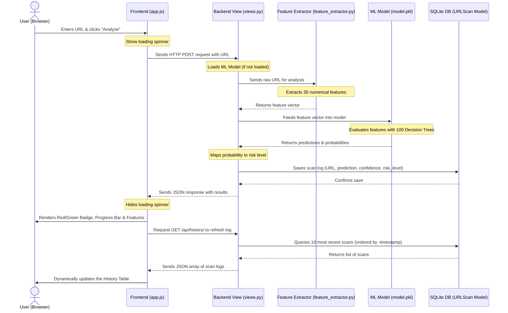

# 🛡️ How PhishShield AI Works: Under the Hood

This document explains exactly what happens step-by-step when you enter a link in **PhishShield AI** and click the **Analyze** button. 

---

## 📊 High-Level Flowchart



---

## 🚶 Step-by-Step Breakdown

### 1. The Trigger (Frontend)
* **What you do:** You paste or type a URL (like `https://www.youtube.com/watch?v=dQw4w9WgXcQ`) into the search bar and click the **Analyze Now** (or **Scan URL**) button.
* **What the website does:** 
  * The frontend JavaScript (`app.js`) intercepts the click.
  * It immediately hides any previous results and displays a pulsing loading spinner to show that analysis is underway.
  * It packages the URL into a JSON payload: `{"url": "https://www.youtube.com/watch?v="...}`.

---

### 2. The API Request (Network Transmission)
* The frontend makes an asynchronous connection request (using the `fetch` API) to your backend server.
* It hits the Django endpoint: **`POST /api/predict/`**.

---

### 3. Receiving the Request (Backend View)
* The Django server receives the request in `api/views.py`.
* **Model Loading:** The backend checks if the machine learning model (`model.pkl`) and scaler are loaded into memory. If it's the first scan since the server started, it lazy-loads them in the background.

---

### 4. Anatomy Analysis (Feature Extraction)
* Before the AI model can understand the URL, it must be turned into numbers. The backend passes the URL to `feature_extractor.py`.
* The **Feature Extractor** measures **30 different structural properties** of the URL, such as:
  * How long is the URL?
  * Does it use `https` or `http`?
  * How many dots (`.`), hyphens (`-`), or slashes (`/`) does it contain?
  * Are there suspicious words in it like `login`, `bank`, or `secure`?
  * Does it end in a suspicious, cheap domain extension (like `.tk` or `.gq`)?
  * How random is the spelling of the domain (entropy)?
* The output is a **numerical vector** (a list of 30 numbers) representing the URL's unique DNA.

---

### 5. Prediction (The Machine Learning Brain)
* The backend feeds the 30-number DNA list into the trained **Random Forest Classifier**.
* **How Random Forest decides:** The model consists of 100 individual "decision trees" trained on historical data. Each tree votes on whether the URL's DNA looks like a safe website or a phishing website.
* The model returns two things:
  1. **The Class:** Either `legitimate` (0) or `phishing` (1).
  2. **The Confidence Probability:** The percentage of trees that voted for that choice (e.g., 94.7% Legitimate vs. 5.3% Phishing).

---

### 6. Risk Level Assignment (Backend View)
The backend translates the raw phishing probability percentage into a human-readable **Risk Level**:
* **< 20% Phishing** ➡️ **`safe`**
* **20% – 39% Phishing** ➡️ **`low`**
* **40% – 59% Phishing** ➡️ **`medium`**
* **60% – 79% Phishing** ➡️ **`high`**
* **≥ 80% Phishing** ➡️ **`critical`**

---

### 7. The Response (Backend to Frontend)
The backend wraps all this information into a JSON response and sends it back to the browser:
```json
{
  "url": "https://www.youtube.com/watch?v=dQw4w9WgXcQ",
  "prediction": "legitimate",
  "is_phishing": false,
  "confidence": 94.7,
  "phishing_probability": 5.3,
  "legitimate_probability": 94.7,
  "risk_level": "safe",
  "top_features": [
    {"name": "URL Length", "importance": 18.5, "value": 43},
    {"name": "Uses HTTPS", "importance": 11.3, "value": 1}
  ]
}
```

---

### 8. Rendering the Results (Frontend UI)
The JavaScript receives the JSON packet, stops the loading spinner, and updates the screen instantly:
* **The Header Badge:** Turns **Green** and says **"LEGITIMATE — Safe URL"** with **94.7%** confidence (or **Red** and **"PHISHING DETECTED — Dangerous URL"**).
* **The Progress Bar:** Adjusts its fill. It acts as a safety-to-danger scale:
  * For a safe URL (phishing probability `5.3%`), the bar fills just a tiny bit on the left (staying in the green **"Safe"** zone).
  * For a malicious URL (phishing probability `89.6%`), the bar fills almost completely to the right (reaching the red **"Dangerous"** zone).
* **The Feature Grid:** Populates a detailed list of the top features evaluated by the model, showing you exactly why the AI made that decision (e.g. telling you the URL length, TLD status, or presence of special characters).

---

### 9. Database Persistence (History Log)
* When a URL scan occurs, a record is persistently stored in the SQLite database through the Django ORM using the `URLScan` model.
* The fields stored are:
  - `url`: The raw scanned URL string.
  - `prediction`: The classification result (`legitimate` or `phishing`).
  - `confidence`: The model prediction confidence percentage.
  - `risk_level`: The risk classification (`safe`, `low`, `medium`, `high`, `critical`).
  - `timestamp`: The date and time of the scan.
* On load and after every scan, the frontend queries `/api/history/` to fetch and render the 10 most recent scans in a tabular format.

---

### 10. Dynamic Performance Metrics & Validation (Results Page)
* The **Results Page** does not display static placeholders. Instead, it queries the backend endpoint `/api/models/` to load performance stats computed during model training (`ml/metrics.json`).
* It renders:
  - **Dynamic Confusion Matrix**: TP, FP, FN, and TN values are updated dynamically according to the current model evaluation.
  - **Random Forest Feature Importance Graph**: A visual progress bar rank of features according to Scikit-Learn's Gini importance calculation.
  - **ROC Curve Integration**: Graphic representing true positive vs. false positive rate trade-offs.
