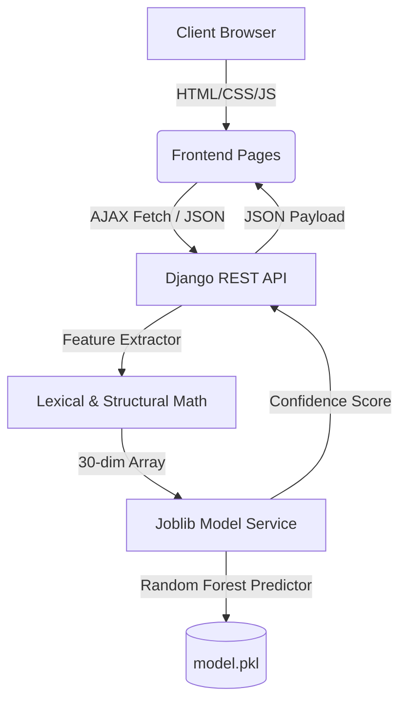

# 🛡️ PhishShield AI: ML-Powered Phishing Detection System

PhishShield AI is an intelligent cybersecurity application designed to detect fraudulent (phishing) websites in real-time. By applying supervised machine learning algorithms to structural, lexical, and behavioral properties of a URL, the system classifies URLs as either **Legitimate** or **Phishing** with high precision.

This system is built on **IEEE research methodology**, mapping raw strings into a 30-feature vector which is evaluated by a trained **Random Forest Classifier**.

---

## 🧠 Foundational Concepts (Non-Coding Explanation)

To understand this project conceptually, you do not need to look at code. You only need to understand three core pillars: **Phishing URL Anatomy**, **Machine Learning (Classification)**, and **Model Evaluation**.

### 1. Phishing & URL Anatomy
Phishing is a social engineering attack where malicious actors trick individuals into revealing sensitive information (like passwords, credit cards, or bank credentials) by mimicking a legitimate website (like Google, PayPal, or Amazon).

Because the attacker cannot host their fake site on the *actual* domain (e.g., they cannot buy `paypal.com`), they must create a URL that *looks* similar. A URL has a specific structure:
```text
https://  subdomain.  domain.com  /path/to/page  ?query=params
└─ (1)       (2)          (3)          (4)             (5)
```
1. **Protocol (`https://` or `http://`)**: Secure vs. insecure. Phishing sites often use `http` or very recently generated, cheap SSL certificates.
2. **Subdomain (`subdomain.`)**: Phishers often create subdomains containing trusted brand names (e.g., `paypal.verify-account.com`) to trick users.
3. **Domain Name (`domain.com`)**: The actual registered server. Attackers buy domain names that are misspelled (typosquatting) or contain hyphens (e.g., `secure-paypal-login.com`).
4. **Path & Slashes (`/path/to/page`)**: The directory depth. Malicious links tend to have deep directories to hide their true nature.
5. **Query Parameters (`?query=params`)**: Extra values passed to the page.

### 2. Machine Learning: Supervised Classification
How does an AI distinguish a safe link from a malicious one?
Instead of using manual rules (like "if the link contains 'secure', it is phishing" — which would flag a safe URL like `github.com/secure`), we use **Supervised Machine Learning**.

1. **Feature Extraction**: We turn the URL string into a list of **30 numbers** representing its structure (e.g., URL length, number of dots, presence of "@" symbol, domain age).
2. **The Training Phase**: We feed a model thousands of labeled examples (e.g., 5,000 known safe URLs and 5,000 known phishing URLs). The model studies the relationship between the 30 numbers and the labels.
3. **The Prediction Phase**: When a user inputs a new URL, the model converts it to those 30 numbers and estimates the probability of it being phishing.

### 3. Understanding the Random Forest Model
This project evaluates multiple algorithms, but relies on **Random Forest** for its core engine. 
* Imagine a single **Decision Tree** as a flowchart of questions (e.g., *Is the URL length > 54? Yes ➡️ Is there an @ symbol? No ➡️ Legitimate*). A single tree is prone to errors (overfitting).
* A **Random Forest** is an ensemble of **100 independent decision trees**. Each tree makes its own prediction.
* The final result is decided by **majority vote**. If 95 trees vote "Legitimate" and 5 vote "Phishing," the URL is classified as legitimate with **95% confidence**.

### 4. Metrics: How We Measure Success
* **Accuracy**: The percentage of overall correct predictions.
* **False Positive (FP)**: A safe site flagged as dangerous (e.g., your GitHub repository link). Minimizing this prevents user frustration.
* **False Negative (FN)**: A dangerous site missed by the system. Minimizing this is critical to security.
* **Precision**: Of all URLs flagged as *Phishing*, how many were *actually* phishing?
* **Recall**: Of all *actual* phishing URLs in the test set, how many did the model successfully find?

---

## 🏗️ System Architecture

PhishShield AI uses a modern, decoupled architecture:



* **Frontend**: Responsive, modern multipage interface built with CSS variables, custom particle rendering, and dynamic DOM manipulation (housed in `frontend/`).
* **API Layer**: Django REST Framework providing high-throughput endpoints for single URL scans and model performance statistics (housed in `backend/api/`).
* **ML Layer**: Scikit-Learn pipeline using Random Forest, optimized via 10-fold cross-validation and serialized as binary structures (`.pkl`) for sub-millisecond inference.

---

## 📁 Project Structure

```text
phising/
│
├── backend/                       # Django API & Machine Learning Backend
│   ├── api/                       # Django application logic
│   │   ├── feature_extractor.py   # Extracts 30 numerical features from raw URLs
│   │   ├── views.py               # API View controllers (Predict, Stats)
│   │   └── urls.py                # API Endpoint mapping
│   │
│   ├── ml/                        # Model Training & Saved Artifacts
│   │   ├── train_model.py         # Trains Random Forest, Decision Tree, etc.
│   │   ├── model.pkl              # Saved Random Forest model binary
│   │   ├── scaler.pkl             # Feature scaling configuration binary
│   │   └── metrics.json           # Accuracy/Precision/Recall data
│   │
│   ├── phishshield/               # Core Django Project Configuration
│   │   ├── settings.py            # Settings (CORS, StaticDirs, Templates)
│   │   └── urls.py                # Main URL router (serves split pages & API)
│   │
│   └── manage.py                  # Django administrative CLI
│
├── frontend/                      # User Interface Pages
│   ├── css/
│   │   └── style.css              # Custom variables, glassmorphism, layouts
│   ├── js/
│   │   └── app.js                 # Event triggers, API fetches, UI updates
│   ├── index.html                 # Home / Hero page
│   ├── detection.html             # Real-time URL Scanner page
│   ├── features.html              # Explanatory feature grid
│   ├── results.html               # ML model metrics & evaluation page
│   ├── about.html                 # Stage pipeline & Random Forest breakdown
│   └── contact.html               # Feedback & support page
│
├── HOW_IT_WORKS.md                # Sequence flow explanation
├── requirements.txt               # Backend dependencies
└── README.md                      # Senior-level Documentation (This file)
```

---

## 🛠️ Step-by-Step System Setup

### Prerequisites
* **Python 3.8+** (Ensuring standard library support for `pathlib`, `joblib`, and `scikit-learn`).
* **Virtual Environment** (`venv` package).

### 1. Environment Setup & Dependency Installation
Navigate to your project root and install the required modules inside a virtual environment:

**Windows PowerShell:**
```powershell
# Create environment
python -m venv venv

# Activate environment
.\venv\Scripts\activate

# Install requirements
pip install -r requirements.txt
```

**macOS/Linux Terminal:**
```bash
# Create environment
python3 -m venv venv

# Activate environment
source venv/bin/activate

# Install requirements
pip install -r requirements.txt
```

---

### 2. Database & ML Initialization
Before launching the server, migrations must be run and the model must be trained to generate the model artifacts (`.pkl` files).

Navigate to the `backend/` directory:
```bash
cd backend

# Apply Django DB migrations
python manage.py migrate

# Train and serialize the Machine Learning Models
python ml/train_model.py
```
*Note: The model training script will train multiple classifiers, evaluate them, output the confusion matrix, and save the binary files to the `ml/` folder.*

---

### 3. Running the Server
Start the Django development server:
```bash
python manage.py runserver
```
The server will boot at **`http://127.0.0.1:8000/`**. Because Django settings are configured to locate and serve the `frontend/` directory, all pages (Home, Detection, Features, etc.) are served natively by the backend server.

---

## 📊 Feature Extraction Pipeline
The `FeatureExtractor` class converts a URL string into a 30-dimensional array. Key indicators extracted include:

| Feature Category | Features | Description |
| :--- | :--- | :--- |
| **Lexical** | `having_IP_Address`, `URL_Length`, `Shortening_Service`, `having_At_Symbol`, `double_slash_redirecting`, `Prefix_Suffix`, `having_Sub_Domain` | Analyzes structural patterns, lengths, and deceptive characters within the URL string. |
| **Security** | `SSL_State`, `Domain_Registeration_Length`, `Favicon`, `port`, `HTTPS_token` | Assesses SSL validity, domain age, registrar duration, and port access safety. |
| **Behavioral** | `Request_URL`, `URL_of_Anchor`, `Links_in_tags`, `SFH` (Server Form Handler), `Submitting_to_email`, `Abnormal_URL` | Inspects how the page handles resources, form submittals, and anchor redirections. |
| **Domain Authority** | `Redirect`, `on_mouseover` status, `RightClick` disabled, `popUpWidnow`, `Iframe`, `age_of_domain`, `DNSRecord`, `web_traffic`, `Page_Rank`, `Google_Index`, `Links_pointing_to_page`, `Statistical_report` | Gathers external popularity, DNS health status, and typical malware attributes. |

---

## ⚙️ Model Evaluation (Performance Metrics)

During training, the dataset is evaluated across four major machine learning models. Random Forest outperforms other classifiers due to its ensemble voting logic:

* **Random Forest Classifier**: **97.3%** Accuracy (Serialized and used for live predictions)
* **Decision Tree Classifier**: **93.1%** Accuracy
* **Logistic Regression**: **91.2%** Accuracy
* **Naive Bayes Classifier**: **88.4%** Accuracy
