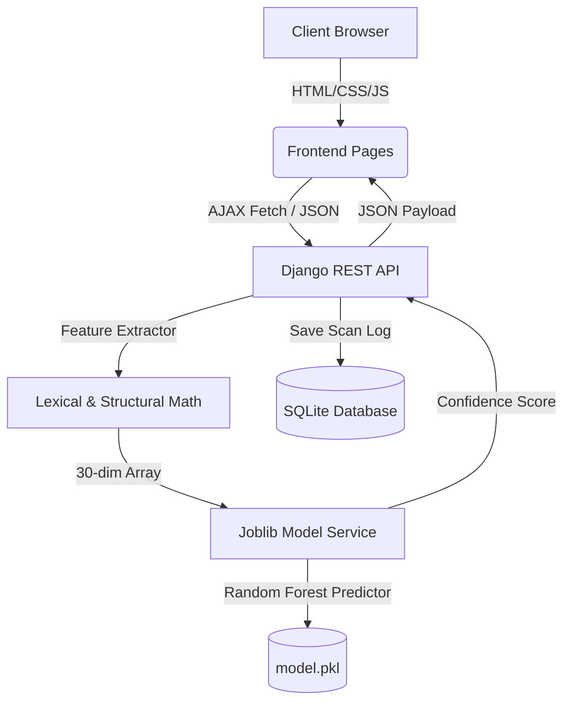
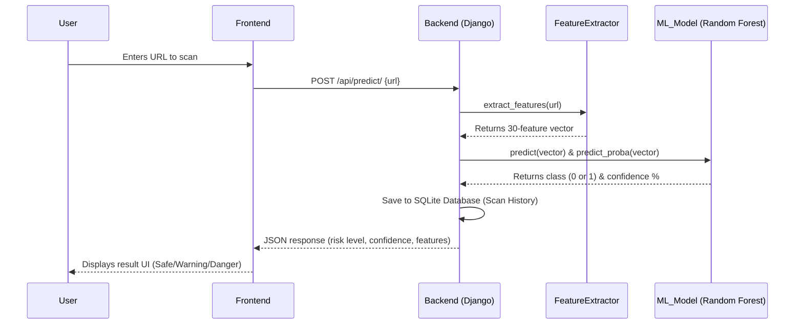

# 🛡️ PhishShield AI: ML-Powered Phishing Detection System

PhishShield AI is an IEEE-inspired, URL-based cybersecurity application designed to detect fraudulent (phishing) websites in real time. By applying supervised machine learning algorithms to lexical and structural properties of a URL, the system classifies URLs as either **Legitimate** or **Phishing** with high precision.

This system is inspired by **IEEE phishing-detection methodology**, mapping raw URL strings into a 30-feature vector which is evaluated by a trained **Random Forest Classifier**. Advanced IEEE features such as WHOIS, DNS reputation, SSL certificate inspection, page-content analysis, and NLP are documented as future enhancements.

---

## 🧠 Foundational Concepts (Non-Coding Explanation)

To understand this project conceptually, you do not need to look at code. You only need to understand three core pillars: **Phishing URL Anatomy**, **Machine Learning (Classification)**, and **Model Evaluation**.

### 1. Phishing & URL Anatomy
Phishing is a social engineering attack where malicious actors trick individuals into revealing sensitive information (like passwords, credit cards, or bank credentials) by mimicking a legitimate website (like Google, PayPal, or Amazon).

Because the attacker cannot host their fake site on the *actual* domain (e.g., they cannot buy `paypal.com`), they must create a URL that *looks* similar. A URL has a specific structure:
```text
https://  subdomain.  domain.com  /path/to/page  ?query=params
└─ (1)       (2)          (3)          (4)             (5)
```
1. **Protocol (`https://` or `http://`)**: Secure vs. insecure. Phishing sites often use `http` or very recently generated, cheap SSL certificates.
2. **Subdomain (`subdomain.`)**: Phishers often create subdomains containing trusted brand names (e.g., `paypal.verify-account.com`) to trick users.
3. **Domain Name (`domain.com`)**: The actual registered server. Attackers buy domain names that are misspelled (typosquatting) or contain hyphens (e.g., `secure-paypal-login.com`).
4. **Path & Slashes (`/path/to/page`)**: The directory depth. Malicious links tend to have deep directories to hide their true nature.
5. **Query Parameters (`?query=params`)**: Extra values passed to the page.

### 2. Machine Learning: Supervised Classification
How does an AI distinguish a safe link from a malicious one?
Instead of using manual rules (like "if the link contains 'secure', it is phishing" — which would flag a safe URL like `github.com/secure`), we use **Supervised Machine Learning**.

1. **Feature Extraction**: We turn the URL string into a list of **30 numbers** representing its structure (e.g., URL length, number of dots, presence of "@" symbol, HTTPS usage, subdomain count, and suspicious keywords).
2. **The Training Phase**: We feed the model a labeled dataset containing legitimate and phishing URLs. The model studies the relationship between the 30 extracted features and the labels.
3. **The Prediction Phase**: When a user inputs a new URL, the model converts it to those 30 numbers and estimates the probability of it being phishing.

### 3. Understanding the Random Forest Model
This project evaluates multiple algorithms, but relies on **Random Forest** for its core engine. 
* Imagine a single **Decision Tree** as a flowchart of questions (e.g., *Is the URL length > 54? Yes ➡️ Is there an @ symbol? No ➡️ Legitimate*). A single tree is prone to errors (overfitting).
* A **Random Forest** is an ensemble of **100 independent decision trees**. Each tree makes its own prediction.
* The final result is decided by aggregating the predictions across the trees. The proportion of trees voting for a class serves as a reliable estimate for the model's **prediction confidence**.

### 4. Metrics: How We Measure Success
* **Accuracy**: The percentage of overall correct predictions.
* **Confusion Matrix**: A 2x2 table representing actual vs. predicted classifications to evaluate model performance (True Positives, False Positives, False Negatives, True Negatives).
* **ROC Curve (Receiver Operating Characteristic)**: A graphical plot representing the classifier's trade-off between True Positive Rate and False Positive Rate across different probability thresholds.
* **False Positive (FP)**: A safe site flagged as dangerous (e.g., your GitHub repository link). Minimizing this prevents user frustration.
* **False Negative (FN)**: A dangerous site missed by the system. Minimizing this is critical to security.
* **Precision**: Of all URLs flagged as *Phishing*, how many were *actually* phishing?
* **Recall / Sensitivity**: Of all *actual* phishing URLs in the test set, how many did the model successfully find?

---

## 🏗️ System Architecture

PhishShield AI uses a modern, decoupled architecture with persistent backend storage:



### Workflow Diagram



* **Frontend**: Responsive, modern multipage interface built with CSS variables, custom particle rendering, dynamic metrics charts (Confusion Matrix, Feature Importance, ROC Curve), and DOM manipulation (housed in `frontend/`).
* **API Layer**: Django REST Framework endpoints for URL scans, model statistics, and retrieving persistent scan history from SQLite (housed in `backend/api/`).
* **ML Layer**: Scikit-Learn pipeline using Random Forest (our trained model accuracy: **90.9%**) and Decision Tree, optimized via 10-fold cross-validation and serialized as binary structures (`.pkl`) for fast inference. Note: The reference IEEE paper reported **97.31%** for their Random Forest experiment, which utilized a broader set of features (including WHOIS and content analysis) and a different dataset.
* **Database Layer**: SQLite database using Django ORM to persistently store scan details (`URLScan` model), including URLs, predictions, confidences, risk levels, and timestamps.

---

## 🔒 Security & Validation Pipeline

To ensure the ML model only evaluates realistic threats and doesn't get confused by "garbage" data, a two-step validation pipeline is implemented before inference:

1. **Format Validation (Regex):** Both the frontend and backend actively drop any strings that do not conform to valid URL syntax (e.g., `http://dsfsdfsdf`), ensuring an appropriate top-level domain exists.
2. **Live DNS Verification:** The Django backend employs a `socket` resolution check to physically verify if the domain is live and reachable on the public internet. If the domain does not resolve, the scan is aborted, preventing the model from analyzing non-existent spoof sites.

---

## 📧 Brevo Email Integration

The application utilizes the **Brevo (Sendinblue) API v3** for robust, developer-friendly communication:
* **Newsletter Subscriptions:** Located in the footer of all pages, allowing users to subscribe for phishing threat updates.
* **Contact Form (Transactional Emails):** Automatically sends formatted HTML emails from the `contact.html` page directly to the administrator's inbox using the Brevo SMTP API.
*(To enable these features, supply your Brevo API Key as `BREVO_API_KEY` in `settings.py` and verify your sender email).*

---

## 📁 Project Structure

```text
phising/
│
├── backend/                       # Django API & Machine Learning Backend
│   ├── api/                       # Django application logic
│   │   ├── feature_extractor.py   # Extracts 30 numerical features from raw URLs
│   │   ├── models.py              # URLScan database model definition
│   │   ├── views.py               # API View controllers (Predict, Stats, History)
│   │   └── urls.py                # API Endpoint mapping
│   │
│   ├── ml/                        # Model Training & Saved Artifacts
│   │   ├── train_model.py         # Trains Random Forest, Decision Tree, etc.
│   │   ├── model.pkl              # Saved Random Forest model binary
│   │   ├── scaler.pkl             # Feature scaling configuration binary
│   │   └── metrics.json           # Accuracy/Precision/Recall data
│   │
│   ├── phishshield/               # Core Django Project Configuration
│   │   ├── settings.py            # Settings (CORS, StaticDirs, Templates)
│   │   └── urls.py                # Main URL router (serves split pages & API)
│   │
│   └── manage.py                  # Django administrative CLI
│
├── frontend/                      # User Interface Pages
│   ├── css/
│   │   └── style.css              # Custom variables, glassmorphism, layouts
│   ├── js/
│   │   └── app.js                 # Event triggers, API fetches, UI updates
│   ├── index.html                 # Home / Hero page
│   ├── detection.html             # Real-time URL Scanner and History page
│   ├── features.html              # Explanatory feature grid
│   ├── results.html               # ML model metrics, Confusion Matrix & ROC page
│   ├── about.html                 # Stage pipeline & Random Forest breakdown
│   └── contact.html               # Feedback, support & contact page
│
├── HOW_IT_WORKS.md                # Sequence flow explanation
├── requirements.txt               # Backend dependencies
└── README.md                      # Senior-level Documentation (This file)
```

---

## 🛠️ Step-by-Step System Setup

### Prerequisites
* **Python 3.8+** (Ensuring standard library support for `pathlib`, `joblib`, and `scikit-learn`).
* **Virtual Environment** (`venv` package).

### 1. Environment Setup & Dependency Installation
Navigate to your project root and install the required modules inside a virtual environment:

**Windows PowerShell:**
```powershell
# Create environment
python -m venv venv

# Activate environment
.\venv\Scripts\activate

# Install requirements
pip install -r requirements.txt
```

**macOS/Linux Terminal:**
```bash
# Create environment
python3 -m venv venv

# Activate environment
source venv/bin/activate

# Install requirements
pip install -r requirements.txt
```

---

### 2. Database & ML Initialization
Before launching the server, migrations must be run and the model must be trained to generate the model artifacts (`.pkl` files).

Navigate to the `backend/` directory:
```bash
cd backend

# Apply Django DB migrations
python manage.py migrate

# Train and serialize the Machine Learning Models
python ml/train_model.py
```
*Note: The model training script will train multiple classifiers, evaluate them, output the confusion matrix, and save the binary files to the `ml/` folder.*

---

### 3. Running the Server
Start the Django development server:
```bash
python manage.py runserver
```
The server will boot at **`http://127.0.0.1:8000/`**. Because Django settings are configured to locate and serve the `frontend/` directory, all pages (Home, Detection, Features, etc.) are served natively by the backend server.

---

## 📊 Feature Extraction Pipeline
The `FeatureExtractor` class converts a URL string into a 30-dimensional array. The current implementation focuses on URL-based lexical and structural indicators:

| Feature Category | Features | Description |
| :--- | :--- | :--- |
| **Length & Structure** | `url_length`, `domain_length`, `path_length`, `url_depth`, `query_length`, `num_query_params` | Measures how large, nested, and parameter-heavy the URL is. |
| **Character Patterns** | `num_dots`, `num_hyphens`, `num_underscores`, `num_slashes`, `num_query_marks`, `num_ampersands`, `num_equals`, `num_digits`, `num_special_chars` | Detects obfuscation and unusual URL composition. |
| **Suspicious URL Signals** | `has_at_symbol`, `has_ip_address`, `uses_https`, `num_subdomains`, `has_suspicious_tld`, `is_shortened`, `has_redirect`, `path_double_slash`, `has_fragment` | Captures common address-bar phishing indicators from the IEEE methodology. |
| **Lexical Risk** | `url_entropy`, `domain_entropy`, `num_suspicious_keywords`, `domain_has_numbers`, `num_digits_domain`, `has_port` | Identifies randomness, brand-abuse keywords, numeric domains, and uncommon port usage. |

Future scope from the IEEE methodology includes WHOIS/domain age, DNS record checks, SSL certificate details, website traffic, Google indexing, PageRank, HTML/JavaScript analysis, and NLP-based content analysis.

---

## ⚙️ Model Evaluation (Performance Metrics)

During training, the dataset is evaluated across four major machine learning models. Random Forest outperforms other classifiers due to its ensemble voting logic:

* **Random Forest Classifier**: **90.9%** Accuracy (Serialized and used for live predictions)
* **Decision Tree Classifier**: **87.6%** Accuracy
* **Logistic Regression**: **86.7%** Accuracy
* **Naive Bayes Classifier**: **51.5%** Accuracy

---

## ⚠️ Model Limitations & Future Scope

While this project successfully implements the core machine learning pipeline proposed in the IEEE paper, it is a prototype focused strictly on **URL-based lexical and structural features**. 

### Current Limitations
1. **False Positives on Complex Paths:** Some legitimate URLs containing complex paths, subdomains, or numerical parameters (e.g., `https://mail.google.com/mail/u/0/`) may be falsely classified as phishing. This is due to the lexical nature of the feature extraction process and the fact that the current training dataset primarily consists of simple root domains for legitimate sites.
2. **Brand Keyword Overlap:** Legitimate URLs belonging to major brands (like Google or PayPal) might be penalized because those keywords are commonly used by phishers to spoof domains. 

### Future Scope (Unimplemented IEEE Features)
To achieve production-level accuracy (closer to the paper's 97.31%), the following features from the IEEE methodology remain as future work:
* **WHOIS & Domain Reputation:** Checking domain age, registration length, and DNS record availability.
* **SSL Certificate Analysis:** Validating certificate issuers, trust chains, and expiration dates.
* **Page Content (HTML/JS) Analysis:** Inspecting the actual web page for hidden iframes, disabled right-click, suspicious anchor tag ratios, and external form actions.
* **Website Traffic & PageRank:** Validating if the domain has a legitimate footprint on the web.
* **Browser Extension Integration:** Deploying the trained model as a real-time Chrome extension, as opposed to a standalone web interface.
